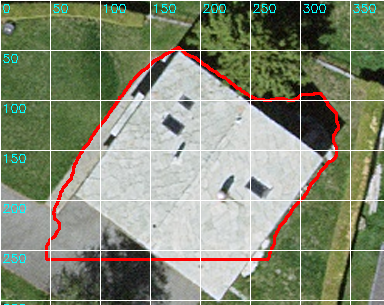
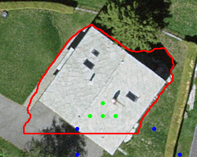
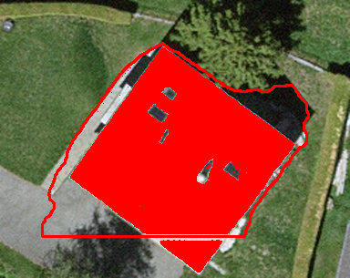
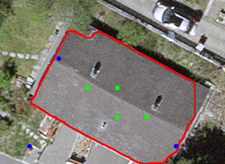
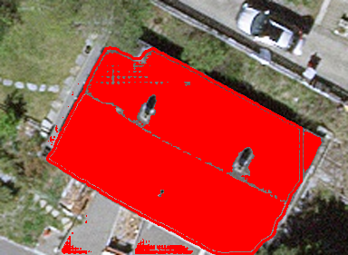
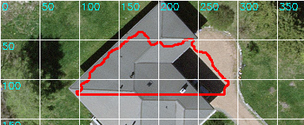
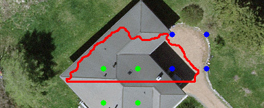
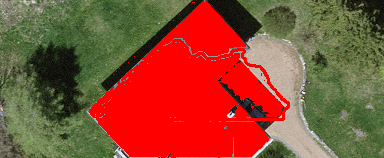

# Intermediate Results: Building Footprint QA

Below are examples showing the three main steps of the proposed QA pipeline:

1. **Raw polygon from SAM/SegFormer** (red outline, often wobbly or with errors).  
2. **MLLM QA step** (polygon chip with grid overlay and generated positive/negative points).  
3. **Refined polygon** (after SAM re-prompt and/or regularization).

---

## Example 1

| Raw Extraction | MLLM QA          | Refined Result        |
|----------------|------------------|-----------------------|
|  |  |  |

---

## Example 2

| Raw Extraction    | MLLM QA          | Refined Result        |
|-------------------|------------------|-----------------------|
|  |  |  |

---

## Example 3

| Raw Extraction    | MLLM QA | Refined Result        |
|-------------------|---------|-----------------------|
|  |  |  |

---

## Communication Channels

### SAM Prompting Options
SAM accepts different kinds of prompts to refine a mask:

- **Points**  
  - Positive points = "this pixel is inside the object"  
  - Negative points = "this pixel is outside the object"  

- **Boxes**  
  - A bounding box is given, SAM segments the object inside.  
  The box is converted into four corner points + edges as a geometric hint.

SAM then segments the object inside the box that best matches local image features.
- **Masks**  
  - Previous mask or polygon can be refined further.  

---

### What the MLLM Does (`scripts/02_mllm_qa.py`)

The MLLM (e.g., GPT-4.1 with vision):

1. **Receives input**  
   - A building chip image (with red outline).  
   - An overlaid white grid with pixel coordinates.  

2. **Tasks**  
   - Decide if the object is a **building** or not.  
   - Detect issues in the polygon outline, chosen from a fixed set:  
     `shadow_inclusion`, `vegetation_overlap`, `road_or_path`,  
     `open_polygon`, `partial_roof`, `shape_inaccurate`, `too_small`,  
     `missing_part`, `other`.  

3. **Outputs**  
   - JSON object with:  
     - `is_building` (true/false)  
     - `issues` (list of detected problems)  
     - `positive_points` = at least 4 coordinates **inside the roof**  
     - `negative_points` = at least 4 coordinates **outside the roof**  

   Example:
   ```json
   {
     "is_building": true,
     "issues": ["shadow_inclusion", "missing_part"],
     "positive_points": [[100,120],[150,140],[200,150],[250,160]],
     "negative_points": [[80,80],[90,200],[230,240],[260,100]]
   }
   
---

### Fusion strategies in the literature:

Adapter-based (LISA) → plug text directly into SAM.

Universal prompt encoder (SEEM) → unify text/points/boxes.

Two-stage pipeline (SAM4MLLM) → MLLM proposes, SAM segments.

Vision-language grounding (Kosmos-2) → direct text-to-pixels.

# QA Pipeline Flow

```mermaid
flowchart TD

    A[Input: Orthophoto + SegFormer/SAM polygons] --> B[Clip chip around polygon]

    B --> C[Overlay polygon + grid for QA chip]

    C --> D[MLLM (GPT-4V/LLaVA)]
    D -->|JSON output: is_building, issues, pos/neg points| E{Valid building?}

    E -->|No| F[Discard polygon]
    E -->|Yes| G[Run SAM refinement with points/mask]

    G --> H[Apply fixes: buffer, simplify, snap_to_rect, erode/dilate]

    H --> I[Validate geometry: area, topology]

    I -->|Valid| J[Save to GeoPackage]
    I -->|Invalid| F

    J --> K[Final Debug Outputs (mask, overlay, refined polygon)]
