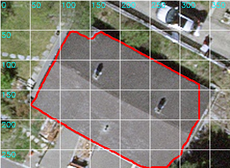

# Intermediate Results: Building Footprint QA

The initial idea is to use a large language model (LLM) to perform quality assurance checks on automatically generated building footprints produced by a visual model.
The key challenge lies in integrating the two models, since they are based on fundamentally different technical approaches.

The plan is to first use a visual model to generate a building mask. Afterwards, the LLM evaluates the mask by identifying typical errors, such as shadows being included, missing parts of the building, or polygons that do not actually represent buildings. The LLM’s suggestions must then be translated into a format that the visual model can understand and apply.

In my tests with the combination of SAM and ChatGPT-4.1, this feedback could take the form of a point mask: the LLM places positive points on the building and negative points outside it, which the visual model can process to improve the mask. Alternatively, bounding boxes or full masks can also be used as correction input.

This combination of multimodal LLMs and visual models has so far mainly been explored for interactive tasks, where the LLM instructs the visual model what to segment. However, using the LLM to assess and correct already generated masks represents a as far as I now new approach.


------------------------------

Below are examples showing the three main steps of the proposed QA pipeline:

1. **Raw polygon from SAM/SegFormer** (red outline, often wobbly or with errors).  
2. **MLLM QA step** (polygon chip with grid overlay and generated positive/negative points).  
3. **Refined polygon** (after SAM re-prompt and/or regularization).

---

## Example 1

| Raw Extraction | MLLM QA          | Refined Result        |
|----------------|------------------|-----------------------|
|  |  |  |

---

## Example 2

| Raw Extraction    | MLLM QA          | Refined Result        |
|-------------------|------------------|-----------------------|
|  |  |  |

---

## Example 3

| Raw Extraction    | MLLM QA | Refined Result        |
|-------------------|---------|-----------------------|
|  |  |  |

---

## Communication Channels

### SAM Prompting Options
SAM accepts different kinds of prompts to refine a mask:

- **Points**  
  - Positive points = "this pixel is inside the object"  
  - Negative points = "this pixel is outside the object"  

- **Boxes**  
  - A bounding box is given, SAM segments the object inside.  
  The box is converted into four corner points + edges as a geometric hint.

SAM then segments the object inside the box that best matches local image features.
- **Masks**  
  - Previous mask or polygon can be refined further.  

---

### What the MLLM Does (`scripts/02_mllm_qa.py`)

The MLLM (e.g., GPT-4.1 with vision):

1. **Receives input**  
   - A building chip image (with red outline).  
   - An overlaid white grid with pixel coordinates.  

2. **Tasks**  
   - Decide if the object is a **building** or not.  
   - Detect issues in the polygon outline, chosen from a fixed set:  
     `shadow_inclusion`, `vegetation_overlap`, `road_or_path`,  
     `open_polygon`, `partial_roof`, `shape_inaccurate`, `too_small`,  
     `missing_part`, `other`.  

3. **Outputs**  
   - JSON object with:  
     - `is_building` (true/false)  
     - `issues` (list of detected problems)  
     - `positive_points` = at least 4 coordinates **inside the roof**  
     - `negative_points` = at least 4 coordinates **outside the roof**  

   Example:
   ```json
   {
     "is_building": true,
     "issues": ["shadow_inclusion", "missing_part"],
     "positive_points": [[100,120],[150,140],[200,150],[250,160]],
     "negative_points": [[80,80],[90,200],[230,240],[260,100]]
   }
   
---

### Fusion strategies in the literature:

Adapter-based (LISA) → plug text directly into SAM.

Universal prompt encoder (SEEM) → unify text/points/boxes.

Two-stage pipeline (SAM4MLLM) → MLLM proposes, SAM segments.

Vision-language grounding (Kosmos-2) → direct text-to-pixels.


# QA Pipeline Flow

```mermaid
flowchart TD
    A[Input: Orthophoto + SegFormer or SAM polygons] --> B[Clip chip around polygon]
    B --> C[Overlay polygon + grid for QA chip]
    C --> D[MLLM step: e.g. GPT-4V, LLaVA]
    D -->|JSON with is_building, issues, points| E{Valid building?}
    E -->|No| F[Discard polygon]
    E -->|Yes| G[Run SAM refinement with points or mask]
    G --> I[Validate geometry: area, topology]
     -->|Valid| J[Save to GeoPackage]
    I -->|Invalid| F
    J --> K[Final debug outputs: mask, overlay, refined polygon]
