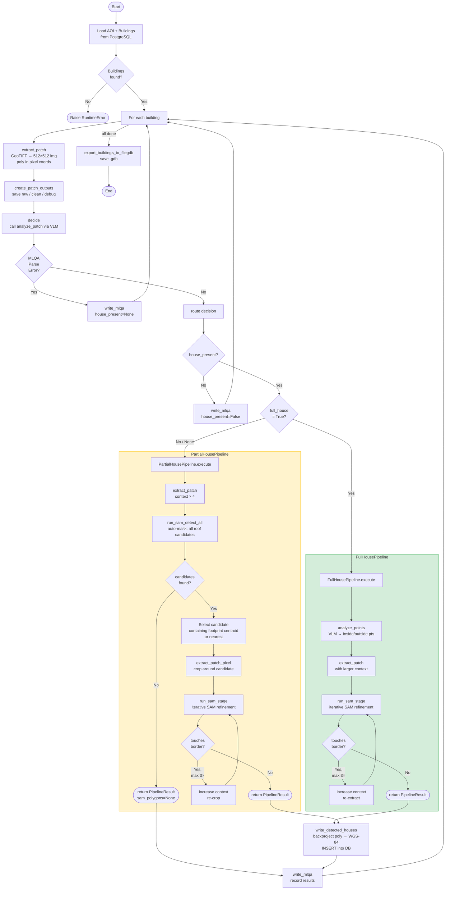

# Source Code Documentation — GeoAI Building Detection Pipeline

> **Master Thesis · Patrick Franzelin**
> Auto-generated reference for every module, class, method, and function inside the `src/` folder.

---

## Table of Contents

1. [Project Overview](#1-project-overview)
2. [Repository Layout](#2-repository-layout)
3. [Full Pipeline Flow Diagram](#3-full-pipeline-flow-diagram)
4. [Module Reference](#4-module-reference)
   - [4.1 `main.py` — Entry Point](#41-mainpy--entry-point)
   - [4.2 `core/context.py` — Pipeline Context](#42-corecontextpy--pipeline-context)
   - [4.3 `db/loader.py` — Database Loader](#43-dbloaderpy--database-loader)
   - [4.4 `db/writer.py` — Database Writer](#44-dbwriterpy--database-writer)
   - [4.5 `db/export_to_filegdb.py` — FileGDB Export](#45-dbexport_to_filegdbpy--filegdb-export)
   - [4.6 `mlqa/mlqa_client.py` — MLQA VLM Client](#46-mlqamlqa_clientpy--mlqa-vlm-client)
   - [4.7 `mlqa/decision.py` — Decision Wrapper](#47-mlqadecisionpy--decision-wrapper)
   - [4.8 `mlqa/point_client.py` — Point Prompt Client](#48-mlqapoint_clientpy--point-prompt-client)
   - [4.9 `mlqa/relocation_client.py` — Relocation Client](#49-mlqarelocation_clientpy--relocation-client)
   - [4.10 `patches/extractor.py` — Patch Extractor](#410-patchesextractorpy--patch-extractor)
   - [4.11 `patches/create_patch_output.py` — Patch Visualizer](#411-patchescreate_patch_outputpy--patch-visualizer)
   - [4.12 `pipelines/base.py` — Pipeline Base Classes](#412-pipelinesbasepy--pipeline-base-classes)
   - [4.13 `pipelines/router.py` — Pipeline Router](#413-pipelinesrouterpy--pipeline-router)
   - [4.14 `pipelines/full_house.py` — Full-House Pipeline](#414-pipelinesfull_housepy--full-house-pipeline)
   - [4.15 `pipelines/partial_house.py` — Partial-House Pipeline](#415-pipelinespartial_housepy--partial-house-pipeline)
   - [4.16 `sam/model.py` — SAM3 (Ultralytics)](#416-sammodelpy--sam3-ultralytics)
   - [4.17 `sam/model_.py` — Fine-Tuned SAM2](#417-sammodel_py--fine-tuned-sam2)
   - [4.18 `sam/refine.py` — SAM Refinement](#418-samrefinepy--sam-refinement)
   - [4.19 `sam/partial.py` — SAM Auto-Mask Discovery](#419-sampartialpy--sam-auto-mask-discovery)
   - [4.20 `utils/geometry.py` — Geometry Utilities](#420-utilsgeometrypy--geometry-utilities)
   - [4.21 `utils/io.py` — I/O Utilities](#421-utilsiopy--io-utilities)
   - [4.22 `utils/rendering.py` — Rendering / Visualization Utilities](#422-utilsrenderingpy--rendering--visualization-utilities)
5. [Data Flow: Coordinate Systems](#5-data-flow-coordinate-systems)
6. [Key External Dependencies](#6-key-external-dependencies)

---

## 1. Project Overview

This codebase implements an **automated building detection and footprint refinement pipeline** for aerial / satellite imagery as part of a GeoAI Master's Thesis.

The pipeline combines three AI-powered technologies:

| Component | Technology | Role |
|-----------|-----------|------|
| **MLQA** (Multi-modal LLM Quality Assessment) | Qwen-VL 8B (visual language model) | Decides whether a building roof is visible, whether the footprint is complete, and describes geometric mismatches. |
| **SAM** (Segment Anything Model) | Ultralytics SAM3 / fine-tuned SAM2 | Produces precise polygon masks from point and bounding-box prompts. |
| **Pipelines** | Custom routing logic | Selects between the *Full-House* or *Partial-House* strategy based on the MLQA decision. |

**High-level summary of a single building run:**
1. Load building footprint + TIFF path from PostgreSQL.
2. Extract an image patch from the GeoTIFF.
3. Ask the VLM whether a roof is present and whether it is fully covered.
4. Route to either `FullHousePipeline` or `PartialHousePipeline`.
5. Run iterative SAM segmentation to refine the polygon.
6. Back-project the polygon from pixel space to WGS-84 and store it in the database.
7. Export final results to FileGDB.

---

## 2. Repository Layout

```
src/
├── __init__.py
├── main.py                      ← entry point / orchestrator
├── core/
│   └── context.py               ← PipelineContext dataclass
├── db/
│   ├── __init__.py
│   ├── loader.py                ← load buildings from PostgreSQL
│   ├── writer.py                ← write MLQA results + detected houses
│   └── export_to_filegdb.py     ← export to ESRI FileGDB
├── mlqa/
│   ├── decision.py              ← HouseDecision dataclass + decide()
│   ├── mlqa_client.py           ← VLM calls: presence, coverage, error
│   ├── point_client.py          ← VLM calls: inside/outside SAM prompt points
│   └── relocation_client.py     ← VLM calls: relocate misaligned centroid
├── patches/
│   ├── extractor.py             ← extract_patch() + extract_patch_pixel()
│   └── create_patch_output.py   ← save raw / clean / debug images
├── pipelines/
│   ├── base.py                  ← abstract Pipeline + PipelineResult
│   ├── router.py                ← route() decision → pipeline
│   ├── full_house.py            ← FullHousePipeline
│   └── partial_house.py         ← PartialHousePipeline
├── sam/
│   ├── model.py                 ← SAM3 (Ultralytics) segmentation
│   ├── model_.py                ← Fine-tuned SAM2 segmentation
│   ├── refine.py                ← run_sam_stage(): iterative refinement
│   └── partial.py               ← run_sam_detect_all(): auto-mask discovery
└── utils/
    ├── geometry.py              ← polygon_to_sam_bbox()
    ├── io.py                    ← ensure_dir(), save_json(), save_points_to_gpkg()
    └── rendering.py             ← image annotation helpers
```

---

## 3. Full Pipeline Flow Diagram



---

## 4. Module Reference

### 4.1 `main.py` — Entry Point

**Purpose:** Orchestrates the entire pipeline for one processing run. Iterates over all buildings in the Area of Interest (AOI), drives MLQA analysis, pipeline execution, result storage, and final GDB export.

**Environment variables required:**
| Variable | Description |
|----------|-------------|
| `PG_CONN` | SQLAlchemy-compatible PostgreSQL connection string |
| `RUNPOD_ID` | RunPod instance ID for the VLM server |

**Execution flow (script-level, no functions):**

1. **Directory setup** — Creates output directories: `outputs/db_results/{sam,raw,clean,debug}`.
2. **`RUN_ID`** — Generated via `uuid4()`. Tags all database rows for this batch.
3. **AOI query** — Loads `src.aoi` where `aoi_id = 1`.
4. **Building query** — Loads up to 100 buildings from `src.buildings` that intersect the AOI and have a `tiff_path`.
5. **Main loop** — For each building:
   - Calls `extract_patch()` → raw image patch + polygon in pixel coords.
   - Calls `create_patch_outputs()` → saves raw/clean/debug PNG files.
   - Calls `decide()` → MLQA decision; on `MLQAParseError` writes uncertainty record and continues.
   - Calls `route()` → selects pipeline or `None` (no house).
   - Calls `pipeline.execute(ctx)` → runs selected pipeline.
   - Normalises `result.sam_polygons` to a list.
   - Calls `write_detected_houses()` and `write_mlqa()`.
6. **Export** — Calls `export_buildings_to_filegdb()` to write a timestamped `.gdb` file.

---

### 4.2 `core/context.py` — Pipeline Context

**Purpose:** Provides a single, typed object that carries all state needed by a pipeline during one building's processing run.

#### Class `PipelineContext`

```
@dataclass
class PipelineContext
```

| Field | Type | Description |
|-------|------|-------------|
| `building_id` | `int` | Primary key of the building in PostgreSQL. |
| `img` | `np.ndarray` | BGR image patch (512×512). |
| `poly_px` | `shapely.Geometry` | Building footprint polygon in patch pixel coordinates. |
| `raw_path` | `Path` | Path to the saved raw PNG. |
| `clean_path` | `Path` | Path to the PNG with green polygon overlay. |
| `debug_path` | `Path` | Path to the PNG with center-star debug marker. |
| `sam_dir` | `Path` | Directory for SAM intermediate output files. |
| `geom` | `shapely.Geometry` | Original building geometry (in `crs` coordinate system). |
| `crs` | `pyproj.CRS` | Coordinate Reference System of `geom`. |
| `tiff_path` | `Path` | Path to the source GeoTIFF raster. |
| `discovery_path` | `Optional[Path]` | (Discovery mode) Path to enlarged context patch. |
| `discovery_img` | `Optional[np.ndarray]` | (Discovery mode) The enlarged context image. |

---

### 4.3 `db/loader.py` — Database Loader

**Purpose:** Loads building footprints from PostgreSQL.

#### Function `load_buildings`

```python
def load_buildings(limit=None) -> gpd.GeoDataFrame
```

| Parameter | Default | Description |
|-----------|---------|-------------|
| `limit` | `None` | Optional `LIMIT` clause; `None` loads all buildings. |

**Returns:** A `GeoDataFrame` with columns `id`, `geom`, `tiff_path`.

**Behaviour:** Reads from `src.buildings` where `tiff_path IS NOT NULL`. Uses `PG_CONN` environment variable.

---

### 4.4 `db/writer.py` — Database Writer

**Purpose:** Persists MLQA analysis results and SAM-detected polygons (back-projected to WGS-84) into PostgreSQL.

#### Function `write_mlqa`

```python
def write_mlqa(result: dict) -> None
```

Writes one row to `src.building_mlqa`. Uses `ON CONFLICT (building_id) DO UPDATE` (upsert) to handle re-runs.

| `result` key | Type | Description |
|--------------|------|-------------|
| `building_id` | `int` | FK to `src.buildings`. |
| `patch_path` | `str` or `None` | Path to the clean patch image. |
| `house_present` | `bool` or `None` | `None` signals a VLM parse error. |
| `full_house_present` | `bool` or `None` | Whether the full building is inside the patch. |
| `error_description` | `str` or `None` | Human-readable mismatch description from VLM. |
| `inside_pts` | `list` | Pixel coords of positive SAM prompt points. |
| `outside_pts` | `list` | Pixel coords of negative SAM prompt points. |

#### Function `write_detected_houses`

```python
def write_detected_houses(
    building_id: int,
    polygons,
    detection_type: str,
    run_id: str,
    tiff_path: str,
    win,
    metadata: dict = None,
) -> None
```

Inserts one row per polygon into `src.detected_house`.

**Coordinate back-projection chain:**

```
PARTIAL pipeline:
  polygon (512×512 refine space)
    ──[undo sub-crop resize]──▶ img_big pixel space
    ──[undo img→win resize]───▶ full raster pixel space
    ──[rasterio affine]────────▶ raster CRS (e.g. UTM)
    ──[pyproj]─────────────────▶ WGS-84 (EPSG:4326)

FULL pipeline:
  polygon (512×512 patch space)
    ──[undo img→win resize]───▶ full raster pixel space
    ──[rasterio affine]────────▶ raster CRS
    ──[pyproj]─────────────────▶ WGS-84
```

| Parameter | Description |
|-----------|-------------|
| `polygons` | List of `shapely.Polygon` objects in 512-px patch space. |
| `detection_type` | `"full"`, `"partial"`, or `"discovery"`. |
| `run_id` | UUID string for the current run. |
| `win` | `rasterio.windows.Window` for the large context patch. |
| `metadata` | Dict; `crop_info` key `(x1, y1, w_crop, h_crop)` is used for PARTIAL. |

---

### 4.5 `db/export_to_filegdb.py` — FileGDB Export

**Purpose:** Exports original building footprints and SAM-improved polygons to an ESRI FileGDB for use in GIS applications.

#### Public Function `export_buildings_to_filegdb`

```python
def export_buildings_to_filegdb(
    engine,
    output_path: str,
    aoi_id: int,
    run_id: str,
    overwrite: bool = False,
) -> None
```

Creates a `.gdb` with two layers:
- `original_buildings` — original footprints from the database.
- `improved_buildings` — SAM-detected polygons for the given `run_id`.

**Internal helpers:**

| Function | Description |
|----------|-------------|
| `_check_filegdb_driver()` | Asserts that the `OpenFileGDB` Fiona driver is available; raises `RuntimeError` otherwise. |
| `_load_original_buildings(engine, aoi_id)` | SQL query returning id, area, confidence, tiff_path for buildings in the AOI. |
| `_load_improved_buildings(engine, aoi_id, run_id)` | SQL query returning SAM detections joined to buildings. |
| `_write_layer(gdb_path, driver, layer_name, schema, rows, is_improved)` | Writes a vector layer using `fiona`. |
| `_build_properties(row, is_improved)` | Constructs the attribute dict for a Fiona feature. |

**Schemas:**

```
ORIGINAL_SCHEMA: building_id (int), area_m2 (float), confidence (float), tiff_path (str)
IMPROVED_SCHEMA: adds detect_id (int), detection_type (str), sam_area (float)
```

---

### 4.6 `mlqa/mlqa_client.py` — MLQA VLM Client

**Purpose:** Performs three sequential Visual Language Model (VLM) API calls to classify a building patch.

**VLM:** Qwen-VL 8B served via RunPod (`RUNPOD_ID` env var). Accessed through an OpenAI-compatible endpoint.

#### Exception `MLQAParseError`

Raised when the VLM response cannot be parsed as valid JSON after cleanup.

#### Public Function `analyze_patch`

```python
def analyze_patch(image_path: Path) -> dict
```

Makes three sequential VLM calls and returns:

```python
{
    "house_present":      bool,
    "full_house_present": bool,
    "error_description":  str | None,
}
```

**Call sequence:**

| # | Call | System Prompt | Returns |
|---|------|---------------|---------|
| 1 | **Presence check** | Expert geospatial analyst detecting roof structures | `{"house_present": true/false}` |
| 2 | **Coverage check** | Evaluates if polygon captures main body of roof | `{"full_house_present": true/false}` |
| 3 | **Error description** | Describes geometric mismatch direction (N/S/E/W) | `{"error_description": "..."}` |

> **Short-circuit:** If call #1 returns `house_present: false`, calls #2 and #3 are skipped.

#### Internal Helpers

| Function | Signature | Description |
|----------|-----------|-------------|
| `_ask` | `(system, user, image_b64) → dict` | Sends a single chat-completion request (temperature=0, max_tokens=256) and returns parsed JSON. |
| `_parse_json_safe` | `(raw: str) → dict` | Tries `json.loads`; on failure strips markdown fences and trailing commas, then retries. Raises `MLQAParseError` on persistent failure. |
| `_encode_image` | `(path: Path) → str` | Returns base64-encoded string of the image file. |

---

### 4.7 `mlqa/decision.py` — Decision Wrapper

**Purpose:** Thin wrapper that calls `analyze_patch` and packages the result into a typed dataclass.

#### Dataclass `HouseDecision`

```python
@dataclass
class HouseDecision:
    house_present: bool
    full_house:    bool | None
    error:         str | None
```

#### Function `decide`

```python
def decide(clean_path: Path) -> HouseDecision
```

Calls `analyze_patch(clean_path)` and maps the raw dict to a `HouseDecision`.

---

### 4.8 `mlqa/point_client.py` — Point Prompt Client

**Purpose:** Asks the VLM to identify SAM prompt points: positive points on the visible roof and negative points on surrounding ground or vegetation.

#### Public Function `analyze_points`

```python
def analyze_points(image_path: Path) -> dict
```

Returns:
```python
{
    "inside":  [[x1, y1], [x2, y2], [x3, y3]],  # positive points
    "outside": [[x4, y4], [x5, y5], [x6, y6]],  # negative points
}
```

Points are in pixel coordinates (0…512).

**Prompts:**
- `POINT_PROMPT_POSITIVE` — Select 3 points clearly on the visible roof.
- `POINT_PROMPT_NEGATIVE` — Select 3 points outside the roof (ground/vegetation).

VLM returns normalized coordinates (0–1000); these are denormalized to pixel space.

#### Internal Helpers

| Function | Signature | Description |
|----------|-----------|-------------|
| `_call_model` | `(prompt, image_b64) → str` | Makes VLM API call; returns raw text response. |
| `_parse` | `(raw: str) → dict` | Parses VLM JSON response. |
| `_encode` | `(path: Path) → str` | Base64 encodes image. |
| `_denormalize` | `(points, width, height) → list` | Converts normalized 0–1000 coordinates to pixel coordinates: `px = norm * dim / 1000`. |

---

### 4.9 `mlqa/relocation_client.py` — Relocation Client

**Purpose:** When a building polygon is misaligned, asks the VLM to identify a single point on the main roof closest to the green polygon boundary. Used to relocate the SAM centroid prompt.

#### Public Function `relocate_building`

```python
def relocate_building(image_path: Path) -> dict
```

Returns:
```python
{
    "inside": [[x, y]]  # single point on the main roof
}
```

**Prompt (`RELOCATION_PROMPT`):** Instructs the VLM to identify one point on the main visible roof structure that is closest to the green polygon boundary.

---

### 4.10 `patches/extractor.py` — Patch Extractor

**Purpose:** Extracts image patches from GeoTIFF files and handles all coordinate transformations between geographic CRS, raster pixel space, and output-image pixel space.

#### Function `extract_patch`

```python
def extract_patch(
    geom,
    geom_crs,
    raster_path,
    out_size: int = 512,
    context: float = 2,
) -> tuple[np.ndarray, shapely.Geometry, rasterio.windows.Window]
```

| Parameter | Description |
|-----------|-------------|
| `geom` | Building geometry in `geom_crs`. |
| `geom_crs` | CRS of `geom` (e.g. WGS-84). |
| `raster_path` | Path to the source GeoTIFF. |
| `out_size` | Output image side length in pixels (default 512). |
| `context` | Multiplier on the building bounding-box side. `context=2` → patch is twice the building size. |

**Steps:**
1. Reprojects `geom` to the raster CRS.
2. Computes a square window: center = building centroid, side = `max(width, height) × context`.
3. Reads RGB bands from the raster into a NumPy array.
4. Resizes to `out_size × out_size` using `INTER_AREA`.
5. Transforms geometry to output-image pixel coordinates.

**Returns:** `(img, poly_px, win)` — resized BGR image, polygon in image-pixel coords, rasterio Window.

#### Function `extract_patch_pixel`

```python
def extract_patch_pixel(
    img: np.ndarray,
    poly_px,
    out_size: int = 512,
    context: float = 2.0,
) -> tuple[np.ndarray, shapely.Geometry, tuple]
```

Extracts a sub-patch from an already-loaded image (used in the PARTIAL pipeline to crop around a detected candidate roof).

| Parameter | Description |
|-----------|-------------|
| `img` | Source image array. |
| `poly_px` | Polygon in source-image pixel coords (e.g. from auto-mask). |
| `out_size` | Output image size. |
| `context` | Context multiplier around the polygon bounding box. |

**Returns:** `(crop_resized, poly_rescaled, crop_info)` where `crop_info = (x1, y1, w_crop, h_crop)` is needed for back-projection.

---

### 4.11 `patches/create_patch_output.py` — Patch Visualizer

**Purpose:** Saves three versions of a patch image for MLQA input and debugging.

#### Function `create_patch_outputs`

```python
def create_patch_outputs(
    img: np.ndarray,
    poly_px,
    out_dirs: dict,
    bid: int,
) -> tuple[Path, Path, Path]
```

| `out_dirs` key | Contents | Used by |
|----------------|----------|---------|
| `raw` | Original image, no overlays | Archive |
| `clean` | Image + green polygon outline | MLQA VLM input |
| `debug` | Image + red center star + "HOUSE" label | Debugging |

**Returns:** `(raw_path, clean_path, debug_path)`

---

### 4.12 `pipelines/base.py` — Pipeline Base Classes

**Purpose:** Defines the shared interface for all pipeline implementations.

#### Dataclass `PipelineResult`

```python
@dataclass
class PipelineResult:
    pipeline_name: str
    sam_polygons:  shapely.Polygon | list | None
    inside_pts:    list
    outside_pts:   list
    metadata:      dict
```

| Field | Description |
|-------|-------------|
| `pipeline_name` | `"FULL"` or `"PARTIAL"` |
| `sam_polygons` | Refined polygon(s) from SAM, or `None` if segmentation failed. |
| `inside_pts` | Positive SAM prompt points used (pixel coords). |
| `outside_pts` | Negative SAM prompt points used (pixel coords). |
| `metadata` | Pipeline-specific data: `mode`, `context_used`, `win`, `crop_info`, etc. |

#### Abstract Class `Pipeline`

```python
class Pipeline(ABC):
    name: str           # class attribute
    def execute(ctx: PipelineContext) -> PipelineResult: ...  # abstract
```

---

### 4.13 `pipelines/router.py` — Pipeline Router

**Purpose:** Maps the `HouseDecision` to the correct `Pipeline` instance (or `None`).

#### Function `route`

```python
def route(decision: HouseDecision) -> Pipeline | None
```

| `decision.house_present` | `decision.full_house` | Returns |
|--------------------------|----------------------|---------|
| `False` | any | `None` |
| `True` | `True` | `FullHousePipeline()` |
| `True` | `False` or `None` | `PartialHousePipeline()` |

---

### 4.14 `pipelines/full_house.py` — Full-House Pipeline

**Purpose:** Handles buildings where the footprint fully covers the visible roof. Asks the VLM for precise inside/outside prompt points, then iteratively runs SAM with expanding context until the result does not touch the image border.

#### Class `FullHousePipeline(Pipeline)`

**`name = "FULL"`**

##### Method `execute`

```python
def execute(self, ctx: PipelineContext) -> PipelineResult
```

**Algorithm:**

```
1. Call analyze_points(ctx.debug_path)
     → inside_base, outside_base  (VLM-selected prompt points)

2. context_refine = 1.5
   for expand_iter in range(3):
     a. Re-extract patch with context_refine factor
     b. run_sam_stage(img, poly_px, inside, outside)
     c. If result == "EXPAND_PATCH":
          context_refine *= 1.5  →  continue
     d. else break

3. return PipelineResult(
       pipeline_name="FULL",
       sam_polygons=refined_polygon,
       inside_pts=inside_base,
       outside_pts=outside_base,
       metadata={"mode":"standard", "context_used":context_refine}
   )
```

---

### 4.15 `pipelines/partial_house.py` — Partial-House Pipeline

**Purpose:** Handles buildings where the footprint is incomplete or misaligned. Performs a two-stage approach: (1) discover all roof candidates in a large context, then (2) refine the most likely candidate.

#### Constants

| Constant | Value | Meaning |
|----------|-------|---------|
| `PARTIAL_CONTEXT_START` | `4.0` | Initial context multiplier for the large discovery patch. |
| `PARTIAL_CONTEXT_REFINE_START` | `4.0` | Starting context for the refinement sub-crop. |

#### Class `PartialHousePipeline(Pipeline)`

**`name = "PARTIAL"`**

##### Method `execute`

```python
def execute(self, ctx: PipelineContext) -> PipelineResult
```

**Algorithm:**

```
1. extract_patch(context=4.0)          → img_big, poly_px_big, win_big
2. run_sam_detect_all(img_big)         → candidates (all detected roofs)
3. If no candidates → return PipelineResult(sam_polygons=None)
4. Select candidate:
   a. First polygon that contains footprint centroid, or
   b. Nearest polygon centroid if none contains it
5. context_refine = 1.5
   for expand_iter in range(3):
     a. extract_patch_pixel(img_big, selected, context_refine)
          → refine_img, refine_poly_px, crop_info
     b. inside = [centroid of refine_poly_px]
     c. run_sam_stage(refine_img, refine_poly_px, inside, outside=[])
     d. If result == "EXPAND_PATCH":
          context_refine *= 1.5  →  continue
     e. else break
6. return PipelineResult(
       pipeline_name="PARTIAL",
       sam_polygons=refined_polygon,
       inside_pts=inside,
       outside_pts=[],
       metadata={
           "stage":"discovery+refine",
           "context_used":context_refine,
           "win":win_big,
           "crop_info":crop_info,
       }
   )
```

---

### 4.16 `sam/model.py` — SAM3 (Ultralytics)

**Purpose:** Wraps Ultralytics `SAM` (SAM3) for prompted image segmentation.

#### Function `segment_with_points`

```python
def segment_with_points(
    image_path: str | Path,
    inside_pts: list,
    outside_pts: list,
    bbox: list | None,
    morph_kernel: int = 8,
    debug: bool = False,
) -> tuple[list[np.ndarray], list[shapely.Polygon]]
```

| Parameter | Description |
|-----------|-------------|
| `inside_pts` | List of `[x, y]` positive prompt points. |
| `outside_pts` | List of `[x, y]` negative prompt points. |
| `bbox` | Optional `[[x1, y1, x2, y2]]` bounding box prompt. |
| `morph_kernel` | Size of the morphological structuring element (default 8). |
| `debug` | If `True`, saves intermediate visualizations. |

**Processing steps:**
1. Load SAM3 model from `models/sam3_weights/sam3.pt`.
2. Run `model.predict(image_path, points=[...], labels=[1/0 ...], bboxes=bbox)`.
3. For each mask:
   - Apply morphological **closing** (fills small holes) with kernel `morph_kernel × morph_kernel`.
   - Apply morphological **opening** (removes small noise).
   - Threshold to binary.
   - Extract contours with `cv2.findContours`.
   - Convert contours to `shapely.Polygon` objects.
4. Return `(masks_list, polygons_list)`.

---

### 4.17 `sam/model_.py` — Fine-Tuned SAM2

**Purpose:** Wraps a fine-tuned SAM2 ViT-B model with a custom building-specific decoder head.

#### Function `segment_with_points`

Same signature as `sam/model.py` with an additional `mode` parameter and `multimask_output` flag.

```python
def segment_with_points(
    image_path,
    inside_pts,
    outside_pts,
    bbox,
    morph_kernel: int = 7,
    debug: bool = False,
    multimask_output: bool = False,
    mode: str = "standard",
) -> tuple[list[np.ndarray], list[shapely.Polygon]]
```

**Key differences from `model.py`:**
- Loads base SAM2 weights + separately fine-tuned building decoder.
- Uses `SamPredictor` API (set image, then predict).
- Morphological pipeline: close 7×7 → median blur (5×5) → open 3×3.
- Filters contours with minimum area **1000 px²**.

---

### 4.18 `sam/refine.py` — SAM Refinement

**Purpose:** Iterative SAM refinement loop. Runs up to `max_iters` SAM predictions, selecting the best polygon each time and tightening the bounding box from the resulting mask. Detects when a polygon touches the image border (indicating the patch is too small) and signals the pipeline to expand.

#### Function `touches_border`

```python
def touches_border(poly, img_shape, margin: int = 3) -> bool
```

Returns `True` if any vertex of `poly` lies within `margin` pixels of any image edge. Used to detect under-cropped patches.

#### Function `run_sam_stage`

```python
def run_sam_stage(
    img: np.ndarray,
    raw_path: Path,
    poly_px,
    inside: list,
    outside: list,
    out_dir: Path,
    bid: int,
    max_iters: int = 3,
    mode: str = "standard",
) -> shapely.Polygon | str | None
```

**Returns:**
- `shapely.Polygon` — best refined polygon.
- `"EXPAND_PATCH"` — signal that the polygon touches the image border; caller should re-extract with a larger context.
- `None` — SAM produced no polygons at all.

**Algorithm per iteration:**

```
bbox ← polygon_to_sam_bbox(poly_px)  (initial; tightened each iteration)
inside ← inside + [bbox_center]      (add bounding-box center as anchor)

for iter in range(max_iters):
    masks, polys ← segment_with_points(raw_path, inside, outside, bbox)
    if no polys: break
    best ← poly whose centroid is closest to poly_px.centroid
    ys, xs ← np.where(best_mask > 0)
    bbox ← tight bounding box of best mask
    inside.append([cx, cy])          (add new centroid anchor)

if touches_border(best, img.shape): return "EXPAND_PATCH"
save debug images (sam_input.png, mask.png, sam.png, selected_iterN.png)
return best polygon
```

**Debug outputs saved:**

| File | Contents |
|------|----------|
| `bld_XXXXXXX_selected_iterN.png` | Image with selected polygon filled/outlined (each iteration). |
| `bld_XXXXXXX_sam_input.png` | Image with MLLM points (green/red) and bounding boxes (blue=initial, yellow=final). |
| `bld_XXXXXXX_mask.png` | Binary SAM mask. |
| `bld_XXXXXXX_sam.png` | Image with final SAM polygon outline. |

---

### 4.19 `sam/partial.py` — SAM Auto-Mask Discovery

**Purpose:** Runs SAM's `SamAutomaticMaskGenerator` on a large context image to detect **all** roof-like regions without any explicit prompt. Used exclusively by `PartialHousePipeline`.

#### Function `run_sam_detect_all`

```python
def run_sam_detect_all(
    img: np.ndarray,
    out_dir: Path,
    bid: int,
) -> list[shapely.Polygon]
```

**SAM generator settings:**

| Setting | Value | Description |
|---------|-------|-------------|
| `points_per_side` | `32` | Grid of prompt points over the image. |
| `pred_iou_thresh` | `0.5` | Minimum predicted IoU to accept a mask. |
| `stability_score_thresh` | `0.7` | Minimum mask stability score. |
| `min_mask_region_area` | `400` | Minimum mask area in pixels² for post-processing. |

**Post-processing filters:**
- Masks with area < **1500 px²** are discarded.
- Masks yielding fewer than **3 polygon vertices** are discarded.

**Outputs saved:**

| File | Contents |
|------|----------|
| `bld_XXXXXXX_partial_mask_N.png` | Individual binary mask for each candidate. |
| `bld_XXXXXXX_partial_overlay.png` | Image with all candidates overlaid in different colors. |

**Returns:** List of `shapely.Polygon` objects — one per accepted roof candidate.

---

### 4.20 `utils/geometry.py` — Geometry Utilities

**Purpose:** Converts a shapely polygon to a SAM-compatible bounding box with optional scaling and padding.

#### Function `polygon_to_sam_bbox`

```python
def polygon_to_sam_bbox(
    poly,
    scale: float = 0.8,
    pad_frac: float = 0.15,
    min_size: int = 200,
) -> list[list[int]] | None
```

| Parameter | Default | Description |
|-----------|---------|-------------|
| `scale` | `0.8` | Scale factor applied to the polygon before computing the bounding box. Values < 1 shrink the prompt box to focus SAM on the building center. |
| `pad_frac` | `0.15` | Fractional padding added to each side of the bounding box. |
| `min_size` | `200` | Minimum side length of the output bounding box in pixels. |

**Algorithm:**
1. Buffer polygon by `scale` (Shapely `buffer`).
2. Compute bounding box of scaled polygon.
3. Add `pad_frac` padding.
4. Enforce `min_size` minimum.

**Returns:** `[[x1, y1, x2, y2]]` (list-of-list, SAM format), or `None` if polygon is invalid.

---

### 4.21 `utils/io.py` — I/O Utilities

**Purpose:** File system and GeoPackage helper functions.

#### Function `ensure_dir`

```python
def ensure_dir(p: Path | str) -> Path
```

Creates the directory (and any parents) if it does not exist. Returns the `Path` object.

#### Function `save_json`

```python
def save_json(obj, path: Path | str) -> None
```

Serialises `obj` to JSON and writes it to `path`.

#### Function `save_points_to_gpkg`

```python
def save_points_to_gpkg(
    out_path: Path | str,
    inside_global: list,
    outside_global: list,
    poly_id: str | int,
    crs,
) -> None
```

Saves inside/outside SAM prompt points as a GeoPackage (`.gpkg`) with an `is_inside` boolean attribute. Useful for QA and visualization in GIS software.

| Parameter | Description |
|-----------|-------------|
| `inside_global` | List of `[x, y]` positive points in geographic coordinates. |
| `outside_global` | List of `[x, y]` negative points in geographic coordinates. |
| `poly_id` | Identifier written to each feature. |
| `crs` | Coordinate Reference System for the output GeoPackage. |

---

### 4.22 `utils/rendering.py` — Rendering / Visualization Utilities

**Purpose:** OpenCV-based image annotation functions used across the pipeline for debugging and MLQA input creation.

#### Function `add_grid_overlay`

```python
def add_grid_overlay(img: np.ndarray, step: int = 50) -> np.ndarray
```

Draws a white grid with cyan pixel-coordinate labels every `step` pixels. Returns a copy of the image.

#### Function `add_center_star`

```python
def add_center_star(
    img: np.ndarray,
    size: int = 25,
    color: tuple = (0, 0, 255),
) -> np.ndarray
```

Draws a red asterisk (`*`) at the image center with a `"HOUSE"` text label above it. Used to mark the building center in debug images.

#### Function `add_polygon_overlay`

```python
def add_polygon_overlay(
    img: np.ndarray,
    polygon,
    color: tuple = (0, 255, 0),
    thickness: int = 2,
) -> np.ndarray
```

Draws a `shapely.Polygon` or `MultiPolygon` on the image in the specified color. The green polygon is the standard MLQA input overlay.

#### Function `draw_points`

```python
def draw_points(
    img: np.ndarray,
    inside_pts: list,
    outside_pts: list,
) -> np.ndarray
```

Draws SAM prompt points as filled circles:
- **Green circles** — `inside_pts` (positive / on-roof points).
- **Red circles** — `outside_pts` (negative / off-roof points).

---

## 5. Data Flow: Coordinate Systems

Understanding the coordinate spaces is critical for the back-projection in `db/writer.py`.

```
WGS-84 (EPSG:4326)
  ↕  pyproj.Transformer
Raster CRS (UTM / local metres, from GeoTIFF)
  ↕  rasterio affine transform
Full-raster pixel space  [0 … raster.width, 0 … raster.height]
  ↕  rasterio.windows.Window offset (col_off, row_off)
Window pixel space  [0 … win.width, 0 … win.height]
  ↕  cv2.resize (win → 512×512)
Patch image pixel space  [0 … 512, 0 … 512]   ← SAM output lives here
  ↕  (PARTIAL only) extract_patch_pixel sub-crop + resize
Refine image pixel space  [0 … 512, 0 … 512]  ← Partial SAM output
```

---

## 6. Key External Dependencies

| Package | Version / Notes | Used in |
|---------|----------------|---------|
| `ultralytics` | SAM3 | `sam/model.py` |
| `segment_anything` | Meta SAM2 | `sam/model_.py`, `sam/partial.py` |
| `torch` | PyTorch | `sam/model_.py` |
| `cv2` (OpenCV) | Image I/O, morphology, drawing | Throughout |
| `rasterio` | GeoTIFF I/O, affine transforms, windows | `patches/extractor.py`, `db/writer.py` |
| `geopandas` | GeoDataFrame, spatial queries | `main.py`, `db/loader.py` |
| `shapely` | Vector geometry, transformations | Throughout |
| `pyproj` | CRS reprojection | `patches/extractor.py`, `db/writer.py` |
| `sqlalchemy` | PostgreSQL ORM / connection | `db/*.py` |
| `fiona` | FileGDB vector writing | `db/export_to_filegdb.py` |
| `openai` | VLM API client (OpenAI-compatible endpoint) | `mlqa/*.py` |
| `numpy` | Array operations | Throughout |

---

*End of documentation.*
